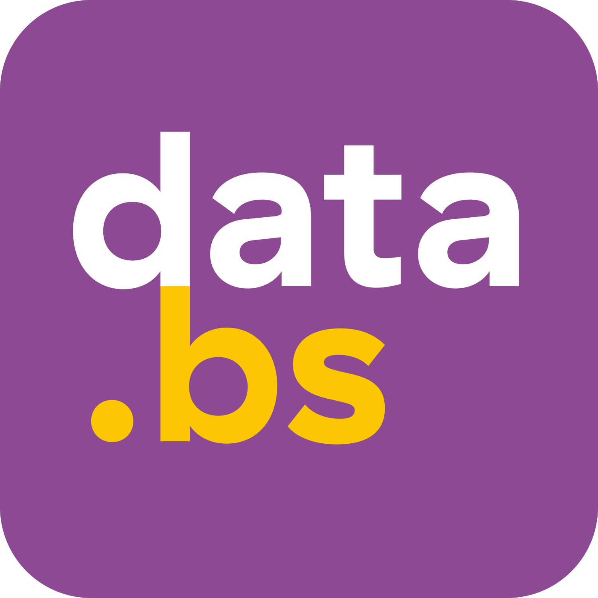

# Text Mate (Backend)

Text Mate Backend is a powerful Python FastAPI service that provides advanced text analysis, correction, and transformation capabilities. This repository contains the backend services for the Text Mate application; the frontend is built with Nuxt.js and available at [https://github.com/DCC-BS/text-mate-frontend](https://github.com/DCC-BS/text-mate-frontend).

---

<p align="center">
  <a href="https://dcc-bs.github.io/documentation/">DCC Documentation & Guidelines</a> | <a href="https://www.bs.ch/daten/databs/dcc">DCC Website</a>
</p>

---

[](https://github.com/astral-sh/ruff)
[](https://img.shields.io/github/license/DCC-BS/transcribo-backend)


## Features

- **Text Correction**: Grammar and spelling correction using LanguageTool integration
- **Text Rewriting**: Advanced text transformation with customizable parameters
- **Document Advisor**: Validates text against reference documents
- **Quick Actions**: Various text processing utilities
- **Word Synonyms**: Intelligent synonym suggestions
- **Sentence Rewrite**: Context-aware sentence transformation

## Technology Stack

- **Framework**: [FastAPI](https://fastapi.tiangolo.com/) with Python 3.13
- **Package Manager**: [uv](https://github.com/astral-sh/uv)
- **Dependency Injection**: Dependency-Injector
- **LLM Integration**: LlamaIndex for LLM model integration
- **Containerization**: Docker and Docker Compose
- **AI Models**: vLLM for serving Qwen3 32B model

## Setup

### Prerequisites

- Python 3.13+
- uv package manager
- Docker and Docker Compose (for containerized deployment)
- NVIDIA GPU with CUDA support (for LLM services)

### Environment Configuration

Create a `.env` file in the project root with the required environment variables:

```
LLM_API_PORT=8001
CLIENT_PORT=3000
CLIENT_URL=http://localhost:${CLIENT_PORT}
OPENAI_API_BASE_URL=http://vllm_qwen3_32B:${LLM_API_PORT}/v1
OPENAI_API_KEY=none
LLM_MODEL=Qwen/Qwen3-32B-AWQ

LANGUAGE_TOOL_PORT=8010
LANGUAGE_TOOL_API_URL=http://languagetool:${LANGUAGE_TOOL_PORT}/v2
LANGUAGE_TOOL_CACHE_DIR=~/.cache/languagetool

HUGGING_FACE_HUB_TOKEN=your_hugging_face_token
HUGGING_FACE_CACHE_DIR=~/.cache/huggingface
```

> **Note:** The `HUGGING_FACE_HUB_TOKEN` is required for Hugging Face API access. You can create a token [here](https://huggingface.co/settings/tokens).

### Install Dependencies

Install dependencies using uv:

```bash
uv sync
```

## Development

Start the development server:

```bash
uv run fastapi dev ./src/text_mate_backend/app.py
```

## Production

Run the production server:

```bash
uv run fastapi run ./src/text_mate_backend/app.py
```

## Docker Deployment

The application includes a Dockerfile and Docker Compose configuration for easy deployment:

### Using Docker Compose

```bash
# Start all services with Docker Compose
docker compose up -d

# Build and start all services
docker compose up --build -d

# View logs
docker compose logs -f
```

### Using Dockerfile Only

```bash
# Build the Docker image
docker build -t text-mate-backend .

# Run the container
docker run -p 8000:8000 text-mate-backend
```

## Testing & Development Tools

Run tests with pytest:

```bash
# Run tests
uv run pytest

# Run with coverage
uv run pytest --cov=src/text_mate_backend tests/
```

Code formatting and linting:

```bash
# Format code with ruff
uv run ruff format .

# Run linting
uv run ruff check .

# Run type checking
uv run mypy .
```

## Project Architecture

- `src/text_mate_backend/`: Main application code
  - `app.py`: FastAPI application entry point
  - `container.py`: Dependency injection container
  - `customLLMs/`: Custom LLM implementations
  - `models/`: Data models and schemas
  - `routers/`: API endpoint definitions
  - `services/`: Business logic services
  - `utils/`: Utility functions and helpers
- `docker/`: Docker configurations for services like LanguageTool
- `docs/`: Reference documents and documentation
- `tests/`: Unit and integration tests

## License

[MIT](LICENSE) © Data Competence Center Basel-Stadt


<a href="https://www.bs.ch/schwerpunkte/daten/databs/schwerpunkte/datenwissenschaften-und-ki"></a>

Datenwissenschaften und KI <br>
Developed with ❤️ by DCC - Data Competence Center
