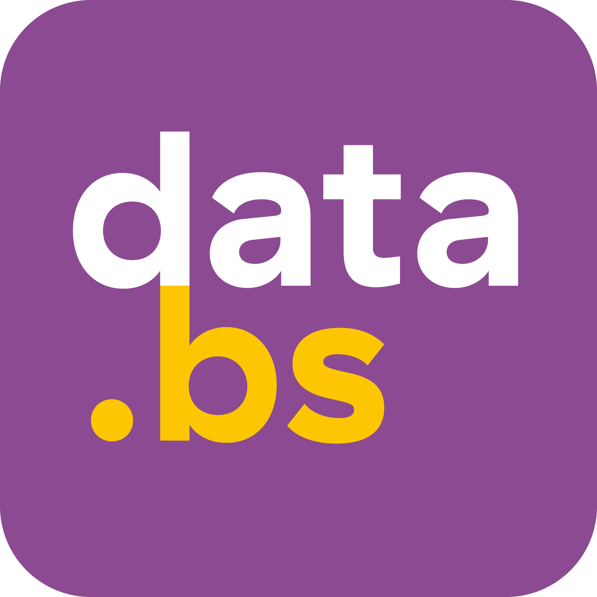

# Text Mate (Backend)

Text Mate Backend is a powerful Python FastAPI service that provides advanced text analysis and transformation capabilities powered by AI. This repository contains the backend services for the Text Mate application; the frontend is built with Nuxt.js and available at [https://github.com/DCC-BS/text-mate-frontend](https://github.com/DCC-BS/text-mate-frontend).

[](https://github.com/astral-sh/ruff)
[](https://img.shields.io/github/license/DCC-BS/text-mate-backend)

---

<p align="center">
  <a href="https://dcc-bs.github.io/documentation/">DCC Documentation & Guidelines</a> | <a href="https://www.bs.ch/daten/databs/dcc">DCC Website</a>
</p>

---

## Features

### Core Capabilities
- **Text Simplification**: AI-powered simplification of complex texts into plain language with readability scoring and fact preservation
- **Text Analysis & Readability**: Multilingual readability scoring (ZIX for German, CEFR, LIX, Gulpease) and language detection (DE, EN, FR, IT)
- **Document Advisor**: Validates text against editorial style guides with violation detection and improvement proposals
- **Word Synonyms**: Intelligent synonym suggestions based on context
- **Sentence Rewrite**: Context-aware sentence transformation
- **Document Conversion**: Convert documents using Docling service (PDF, DOCX, etc.)
- **Custom User Actions**: Role-gated and customized AI transformations loaded from Markdown definitions

### Quick Actions
Many specialized AI-powered text transformations:
- **Summarize**: Generate concise summaries of long texts
- **Bullet Points**: Convert paragraphs into structured bullet points
- **Formality**: Adjust text formality level (formal/informal)
- **Medium Length**: Optimize text for medium-length output
- **Plain Language**: Simplify complex text to plain language
- **Social Media**: Optimize content for social media platforms
- **Proofread**: Comprehensive grammar and style checking
- **Character Speech**: Adapt text to character voice and speech patterns
- **Custom**: Flexible custom text transformations

### Development Features
- **Streaming Responses**: Real-time text generation with streaming support
- **Health Probes**: Built-in health check endpoints for all services
- **Logfire Integration**: Advanced debugging and monitoring in development mode
- **Azure AD Authentication**: Enterprise-ready authentication with Azure AD

## Technology Stack

- **Framework**: [FastAPI](https://fastapi.tiangolo.com/) with Python 3.13+
- **Package Manager**: [uv](https://github.com/astral-sh/uv)
- **Tool Manager**: [mise](https://mise.jdx.dev/) — pins and installs `uv`, `varlock`, and `pass-cli`, and provides project tasks
- **Dependency Injection**: Dependency-Injector
- **LLM Integration**: pydantic-ai for AI model integration
- **AI Model**: Gemma 4 31B served via vLLM
- **Document Processing**: Docling
- **Containerization**: Docker and Docker Compose
- **Monitoring**: Logfire for observability

## Prerequisites

- **Python**: 3.13 or higher
- **mise**: [Installation guide](https://mise.jdx.dev/getting-started.html) — recommended. It automatically installs and pins the project tools (`uv`, `varlock`, `pass-cli`, `usage`) as declared in [`mise.toml`](mise.toml). With mise you do **not** need to install these tools manually.
- **uv package manager**: [Installation guide](https://github.com/astral-sh/uv) — only needed if you are not using mise
- **Docker & Docker Compose**: For containerized deployment
- **NVIDIA GPU** with CUDA support:
  - 2 GPUs recommended (for vLLM tensor parallelism)
  - GPU memory: ~20GB+ per GPU for Gemma-4-31B model
  - CUDA toolkit installed
- **varlock**: For environment variables validation (installed automatically by mise)
- **pass-cli**: For varlock with Proton Pass integration (installed automatically by mise via the [`DCC-BS/mise-proton-pass-cli`](https://github.com/DCC-BS/mise-proton-pass-cli) plugin)

## Setup

### Environment Configuration

Create a `.env` file in the project root with the required environment variables:

```
AUTH_MODE=none # or azure
LOG_LEVEL=debug
HMAC_SECRET=... # create a new secret with openssl rand 32 | base64
```

#### Optional Environment Variables

The following environment variables have defaults and can be overridden as needed:

| Variable | Description | Default | Type |
|----------|-------------|---------|------|
| **Environment Settings** |
| `APP_MODE` | Application mode (controls varlock validation) | `dev` | enum: dev, ci, build, prod |
| `IS_PROD` | Flag for production mode (used by logger) | Auto-calculated from APP_MODE | boolean |
| **Ports** |
| `PORT` | FastAPI backend app port | `8000` | port |
| `LLM_API_PORT` | LLM API port | `8001` | port |
| `CLIENT_PORT` | Client application port | `3000` | port |
| `DOCLING_API_PORT` | Docling API port | `5001` | port |
| **URLs** |
| `CLIENT_URL` | Client application URL | `http://localhost:3000` (dev) | URL |
| `DOCLING_URL` | Docling service URL | `http://localhost:5001/v1` (dev) | URL |
| `LLM_URL` | LLM API URL | `http://localhost:8001/v1` (dev) | URL |
| `LLM_HEALTH_CHECK_URL` | LLM health check URL | `http://localhost:8001/health` (dev) | URL |
| **LLM Configuration** |
| `LLM_MODEL` | Model for LLM API | `Gemma/Gemma-4-31B` (dev) | string |
| `LLM_API_KEY` | API key for LLM endpoint authentication | `none` (dev) | string (sensitive in prod) |
| **Service Keys** |
| `DOCLING_API_KEY` | Docling API key | `none` | string (sensitive in prod) |
| `HUGGING_FACE_HUB_TOKEN` | Hugging Face API token | - | string (optional, sensitive) |
| **Docker Cache Directories** |
| `CACHE_DIR` | Base cache directory | `~/.cache` | path |
| `HUGGING_FACE_CACHE_DIR` | Hugging Face cache directory | `${CACHE_DIR}/huggingface` | path |

> **Note:** URLs are automatically set based on the `APP_MODE`. In production, these must be configured explicitly.

#### Azure Environment Variables

When `AUTH_MODE=azure`, the following Azure AD variables are **required**:

| Variable | Description | Default | Type |
|----------|-------------|---------|------|
| `AZURE_CLIENT_ID` | Azure AD application client ID | - | UUID (required) |
| `AZURE_TENANT_ID` | Azure AD tenant ID | - | UUID (required) |
| `AZURE_FRONTEND_CLIENT_ID` | Azure AD frontend application client ID | - | UUID (required) |
| `AZURE_SCOPE_DESCRIPTION` | Azure AD authentication scope | `user_impersonation` | string |

> **Note:** You can create a Hugging Face token [here](https://huggingface.co/settings/tokens).

Use [varlock](https://varlock.dev/) to validate the env variables:

```bash
varlock load
```

### Install Dependencies

Using mise (recommended) — this installs the pinned tools and then runs the project's `install` task automatically via the `postinstall` hook:

```bash
mise install
```

> **Note:** `mise install` installs both tools **and** tasks. A `postinstall` hook in `mise.toml` triggers the `install` task, which runs `uv sync` and installs the pre-commit hooks. An `enter` hook runs `enter-checks`, which warns you if you are not logged into `pass-cli`.

Or manually (without mise):

```bash
uv sync
uv run pre-commit install
```

## Services Architecture

The application consists of three main services:

| Service | Port | Description |
|---------|------|-------------|
| **FastAPI Backend** | 8000 | Main application API |
| **vLLM Service** | 8001 | Gemma-4-31B model inference (v0.26.0) |
| **Docling** | 5001 | Document conversion service (CPU) |

### GPU Allocation
- GPUs 0 & 1 (`device_ids: ["0", "1"]`): vLLM service for LLM inference (tensor parallel size 2)

## Development

### Start Development Server

```bash
# Start all required services with Docker
mise docker-up    # or: make docker-up

# Start the development server
mise dev          # or: make dev
```

The API will be available at `http://localhost:8000`

### API Documentation

Access the interactive API documentation:
- **Swagger UI**: http://localhost:8000/docs
- **ReDoc**: http://localhost:8000/redoc
- **Health Check**: http://localhost:8000/health

### Development Tools

```bash
# Run code quality checks (format, lint, type check)
mise check        # or: make check

# Run tests
mise test         # or: make test

# Run tests with coverage
uv run pytest --cov=src/text_mate_backend tests/

# Run specific test file
uv run pytest tests/test_simplify_service.py
```

### Mise Tasks

The project's commands are defined as [mise tasks](mise.toml) and can be run with `mise <task>` or via their short alias (`mise <alias>`). The [`Makefile`](Makefile) mirrors the same commands if you prefer `make`.

| Task | Alias | Description |
|------|-------|-------------|
| `mise install` | `mise i` | Install dependencies and pre-commit hooks (also runs automatically via the `postinstall` hook) |
| `mise dev` | `mise d` | Start development server with hot reload |
| `mise run` | `mise r` | Start production server |
| `mise test` | `mise t` | Run test suite (including doctests) |
| `mise check` | `mise c` | Run lockfile check, format, lint, type check, and varlock scan |
| `mise ci` | — | Run all CI checks (`check` + `test`) |
| `mise env-check` | `mise env` | Load secrets into the environment via varlock |
| `mise docker-up` | `mise up` | Start all Docker services |
| `mise docker-down` | `mise down` | Stop and remove Docker services |
| `mise docker-logs` | `mise logs` | Tail Docker service logs |
| `mise pass-login` | `mise login` | Login to Proton Pass CLI for secret access |
| `mise help` | — | Show all available tasks |

> **Makefile equivalents:** `make install`, `make dev`, `make run`, `make test`, `make check`, `make docker-up`, `make docker-down`, `make docker-logs`, `make help`.

### Tool Management with mise

[`mise.toml`](mise.toml) declares everything mise needs to set up a working environment:

- **Pinned tools** (under `[tools]`): `varlock`, `pass-cli`, `usage`, and `uv`. Running `mise install` fetches the exact versions, so every contributor gets the same toolchain without manual setup.
- **Custom plugin** (under `[plugins]`): `pass-cli` is installed from the [`DCC-BS/mise-proton-pass-cli`](https://github.com/DCC-BS/mise-proton-pass-cli) plugin.
- **Hooks** (under `[hooks]`):
  - `postinstall` → runs the `install` task after tools are installed, so `uv sync` and pre-commit hooks are set up automatically.
  - `enter` → runs the `enter-checks` task, which warns you to log into `pass-cli` when entering the project directory.

#### Custom task scripts

Additional tasks live in [`.mise-tasks/`](.mise-tasks) as executable shell scripts with frontmatter metadata:

| Script | Description |
|--------|-------------|
| `.mise-tasks/enter-checks` | Hidden check that warns if you are not logged into `pass-cli` (runs via the `enter` hook) |
| `.mise-tasks/pass-login` | Logs into Proton Pass CLI (exposed as the `pass-login` task / `login` alias) |

## Production

### Run Production Server

```bash
mise run    # or: make run
```

Or manually:

```bash
varlock run -- uv run uvicorn text_mate_backend.app:app --port 8000 --no-access-log
```

## Docker Deployment

### Using Pre-built Image

```bash
docker pull ghcr.io/dcc-bs/text-mate-backend:latest
```

### Manual Docker Build

```bash
# Build the Docker image
docker build -t text-mate-backend .

# Run the container
docker run -p 8000:8000 text-mate-backend
```

## Project Architecture

```
src/text_mate_backend/
├── app.py                          # FastAPI application entry point
├── container.py                    # Dependency injection container
├── agents/                         # AI agent implementations
│   └── agent_types/
│       ├── quick_actions/         # Built-in quick action agents (9 types)
│       ├── fix_agent.py           # Fix generation agent
│       ├── proposal_agent.py      # Advisor proposal agent
│       ├── sentence_rewrite_agent.py # Sentence rewrite agent
│       ├── violation_detection_agent.py # Advisor violation detection agent
│       └── word_synonym_agent.py  # Word synonym agent
├── models/                         # Pydantic data models and schemas
├── readability/                    # Readability scoring & language detection
│   ├── core/                      # Tokenization, formulas, bands
│   ├── languages/                 # Language analyzers (German, English, French, Italian)
│   ├── detection.py               # Fast language detection
│   └── registry.py                # Analyzer registry
├── routers/                        # API endpoint definitions
│   ├── advisor.py                 # Document advisor endpoint (/advisor)
│   ├── convert_route.py           # Document conversion endpoint (/convert)
│   ├── quick_action.py            # Quick actions endpoint (/quick-action)
│   ├── sentence_rewrite.py        # Sentence rewrite endpoint (/sentence-rewrite)
│   ├── simplify.py                # Text simplification endpoint (/simplify)
│   ├── text_analysis.py           # Readability & analysis endpoint (/text-analysis)
│   ├── user_action_route.py       # Custom user actions endpoint (/user-action)
│   └── word_synonym.py            # Word synonym endpoint (/word-synonym)
├── services/                       # Business logic services
│   ├── actions/                   # Quick action service
│   ├── advisor.py                 # Advisor service
│   ├── azure_service.py           # Azure AD auth service
│   ├── document_conversion_service.py # Docling document conversion
│   ├── fix_service.py             # Rule fix application service
│   ├── sentence_rewrite_service.py # Sentence rewrite service
│   ├── simplify_service.py        # Text simplification pipeline
│   ├── text_analysis_service.py   # Readability analysis service
│   └── user_actions_service.py    # Custom user actions service
└── utils/                          # Utility functions and helpers
    ├── auth.py                    # Authentication utilities
    ├── configuration.py           # Configuration management
    └── middleware.py              # Request/response middleware

src/text_mate_tools/                # Utility and evaluation scripts
├── advisor_eval/                  # Advisor eval scoring and harness
├── simplify_eval/                 # Simplify eval scoring and corpus harness
├── preprocess_document_rules.py   # AI-assisted rule extraction from PDFs
├── count_rules_per_file.py        # Rule count per collection and source PDF
├── analyse_rules.py               # Rule analysis across all collections
├── consolidate_rules.py           # Rule consolidation utility
├── generate_eval_cases.py         # Eval case generator
├── run_advisor_eval.py            # Run Advisor evaluation suite
└── run_simplify_eval.py           # Run Simplify evaluation suite

evals/                              # Evaluation datasets
├── advisor/                       # Advisor test cases
└── simplify/                      # Simplification test cases

assets/docs/
├── rules/                          # Rule collections (one JSON per collection)
│   ├── bundeskanzlei.json         # Merged Bundeskanzlei rules (51 rules)
│   └── merkblatt_behoerdenbriefe.json  # Behördenbriefe rules (14 rules)
├── meta/
│   └── bund_dokumente.json        # Collection metadata shown to API consumers
└── *.pdf                          # Source PDF documents

assets/actions/                     # Role-gated custom quick actions (Markdown)
├── goblin.md                      # Example: admin-only action
└── middleage-slang.md             # Example: admin-only action

tests/                              # Unit and integration tests
```

## Custom Quick Actions

Custom quick actions let you add role-gated LLM instructions without touching Python code. They appear alongside the built-in quick actions (Summarize, Plain Language, etc.) in the frontend and are executed by the same `POST /quick-action` endpoint.

### How it works

1. At startup the backend scans `assets/actions/*.md` and loads every file as a `UserAction`.
2. `GET /user-action` returns only the actions the current user may see, filtered by their Azure Entra ID roles.
3. The frontend calls `POST /quick-action` with `{ "action": "<id>", "text": "..." }`.
4. If the `action` value is not a built-in action ID, the service looks it up in the loaded user actions and uses its Markdown body as the LLM system prompt.

### File format

Each action is a single Markdown file in `assets/actions/` with a YAML frontmatter block:

```markdown
---
id: my-action-id
name: Display Name
groups: ["role-name-in-azure"]
---
Write the LLM instruction here. This becomes the system prompt.

You can use full Markdown — headings, lists, code blocks — to structure the prompt.
```

| Field | Required | Description |
|---|---|---|
| `id` | yes | Unique identifier. Used as the `action` value in `POST /quick-action`. Must not clash with built-in action IDs (`plain_language`, `bullet_points`, `summarize`, `social_mediafy`, `formality`, `medium`, `custom`, `proofread`, `character_speech`). |
| `name` | yes | Display name shown to the user in the frontend. |
| `groups` | no | List of Azure Entra ID role names that may see and run this action. Empty list (`[]` or omitted) makes it visible to **all** authenticated users. |

The body (everything after the closing `---`) is sent verbatim as the LLM instruction. It has access to the user's input text.

### Access control

`groups` values are matched against the roles on the authenticated user's Azure Entra ID token. A user must have **at least one** of the listed roles to see the action. When `AUTH_MODE=none` (dev), the `/user-action` endpoint returns an empty list (no user context available).

### Example

```markdown
---
id: goblin
name: Goblin Rewrite
groups: ["admin"]
---
Rewrite a text like you are a goblin.
```

This action is only visible to users with the `admin` role in Azure Entra ID. Any other user will not see it in `GET /user-action` and cannot trigger it.

### Adding a new action

1. Create a `.md` file in `assets/actions/` following the format above.
2. Restart the backend — actions are loaded once at startup.
3. Verify the action appears for the right users via `GET /user-action`.

> **No code change required.** The file name does not matter; only the `id` field is used.

## Advisor Rule Collections

The Document Advisor validates text against editorial rules sourced from Bundeskanzlei PDFs. Rules are organized into **collections** — logical groups exposed to API consumers:

| Collection ID | File | Source PDFs |
|---|---|---|
| `bundeskanzlei` | `assets/docs/rules/bundeskanzlei.json` | Schreibweisungen, Rechtschreibleitfaden, Empfehlungen Anglizismen, Geschlechtergerechte Sprache |
| `merkblatt_behoerdenbriefe` | `assets/docs/rules/merkblatt_behoerdenbriefe.json` | Merkblatt Behördenbriefe |

Each rule has:
- `name` — short rule title
- `description` — full rule description
- `file_name` — source PDF filename (used for citation in violations)
- `page_number` — page in the source PDF
- `example` — `Falsch: ... | Richtig: ...` string
- `collection` — collection ID (used for filtering; must match `id` in `bund_dokumente.json`)

Collection metadata shown to API consumers is in `assets/docs/meta/bund_dokumente.json`. Each entry has:
- `id` — collection ID (matches `Rule.collection`)
- `title` / `description` / `author` / `edition` — display metadata
- `files` — list of downloadable source PDFs
- `access` — list of roles, or `["all"]` for public access

### Adding Rules to an Existing Collection

**Option A — Manual:** Edit the collection JSON directly.

Add a rule object to the `rules` array in the appropriate file (e.g. `assets/docs/rules/bundeskanzlei.json`):

```json
{
  "name": "Rule name",
  "description": "Full rule description.",
  "file_name": "schreibweisungen.pdf",
  "page_number": 42,
  "example": "Falsch: ... | Richtig: ...",
  "collection": "bundeskanzlei"
}
```

`file_name` must be an existing PDF under `assets/docs/`. `collection` must match the `id` in `bund_dokumente.json`.

**Option B — AI extraction from a PDF:** Use the preprocessing tool to extract rules automatically, then review and merge.

```bash
# Extract rules from a PDF into a staging directory
uv run --env-file .env src/text_mate_tools/preprocess_document_rules.py \
  assets/docs/schreibweisungen.pdf \
  --collection bundeskanzlei \
  --output ./staging/rules

# Review the output
cat staging/rules/schreibweisungen.json

# Copy rules into the collection file (manual merge or jq)
```

After editing, run `make check` to verify everything is valid.

### Adding a New Collection

1. **Add rules JSON** — create `assets/docs/rules/<collection-id>.json` with the `collection` field set on every rule.

2. **Add the source PDF** — place the PDF in `assets/docs/`.

3. **Register the collection** — add an entry to `assets/docs/meta/bund_dokumente.json`:

```json
{
  "title": "Collection display name",
  "description": "Short description for the UI",
  "author": "Author name",
  "edition": "Edition string",
  "id": "<collection-id>",
  "files": ["source.pdf"],
  "access": ["all"]
}
```

4. **Run checks** — `make check`.

> **API impact:** Adding a new collection is a non-breaking change — consumers only see the new entry when they call `GET /advisor/docs`. Renaming or removing a collection ID is breaking.

### Analysing Rules

```bash
# Count rules per collection and source PDF
uv run src/text_mate_tools/count_rules_per_file.py

# Detailed analysis (char counts per collection)
uv run src/text_mate_tools/analyse_rules.py
```

## Troubleshooting

### GPU Memory Errors

**Issue**: Out of memory errors when starting vLLM service

**Solutions**:
- Ensure GPU has at least 20GB memory
- Reduce `--gpu-memory-utilization` in docker-compose.yml (default: 0.90)
- Reduce `--max-model-len` (default: 6000)

### Hugging Face Token Issues

**Issue**: Cannot download model from Hugging Face

**Solutions**:
- Verify `HUGGING_FACE_HUB_TOKEN` is set correctly
- Ensure token has read access to the model repository
- Create token at https://huggingface.co/settings/tokens

### Service Health Check Failures

**Issue**: Health check endpoint returns errors

**Solutions**:
- Check if all services are running: `docker ps`
- View service logs: `make docker-logs`
- Verify URLs in `.env` match Docker service names
- Check GPU availability: `nvidia-smi`

### Varlock Configuration Issues

**Issue**: varlock validation fails

**Solutions**:
- Ensure pass-cli is installed and authenticated
- Check Proton Pass credentials
- Verify `.env.schema` syntax
- Run `varlock load` for detailed errors

### Authentication Errors (Azure AD)

**Issue**: Azure AD authentication fails

**Solutions**:
- Verify all Azure environment variables are set
- Check `AZURE_CLIENT_ID` and `AZURE_TENANT_ID` are correct
- Ensure Azure AD app registration is configured properly
- Verify redirect URIs match your application URL

## License

[MIT](LICENSE) © Data Competence Center Basel-Stadt

<a href="https://www.bs.ch/schwerpunkte/daten/databs/schwerpunkte/datenwissenschaften-und-ki"></a>

Datenwissenschaften und KI <br>
Developed with ❤️ by DCC - Data Competence Center
